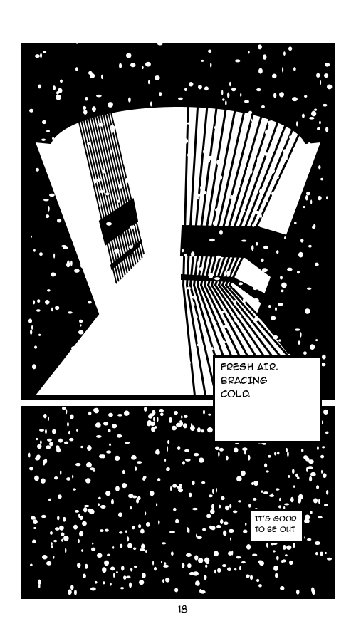
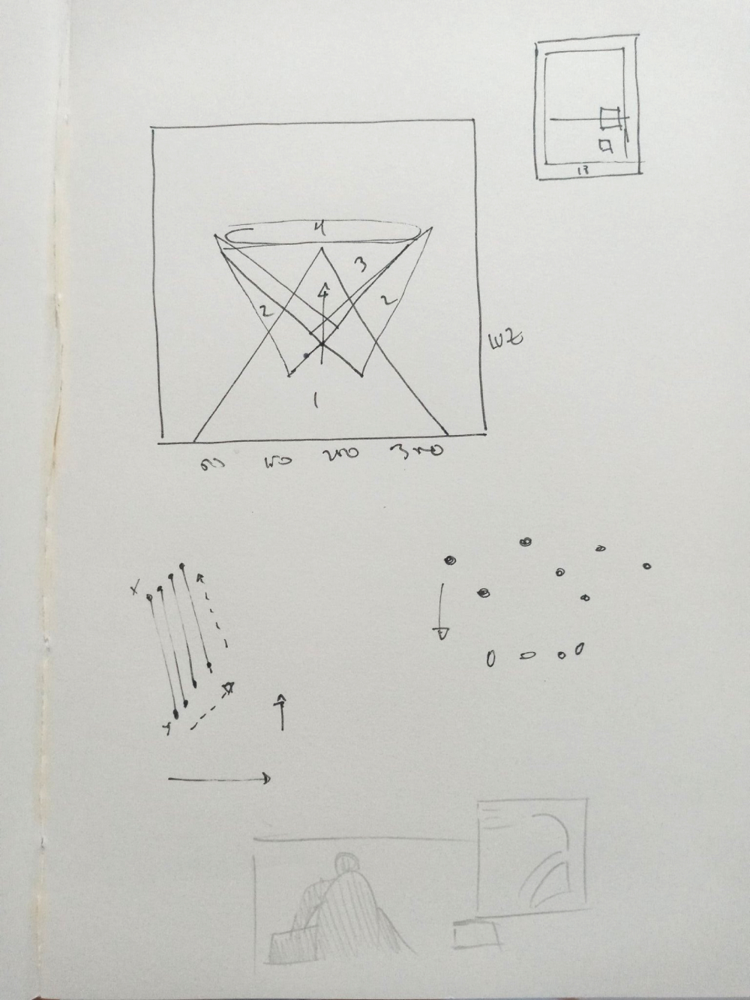
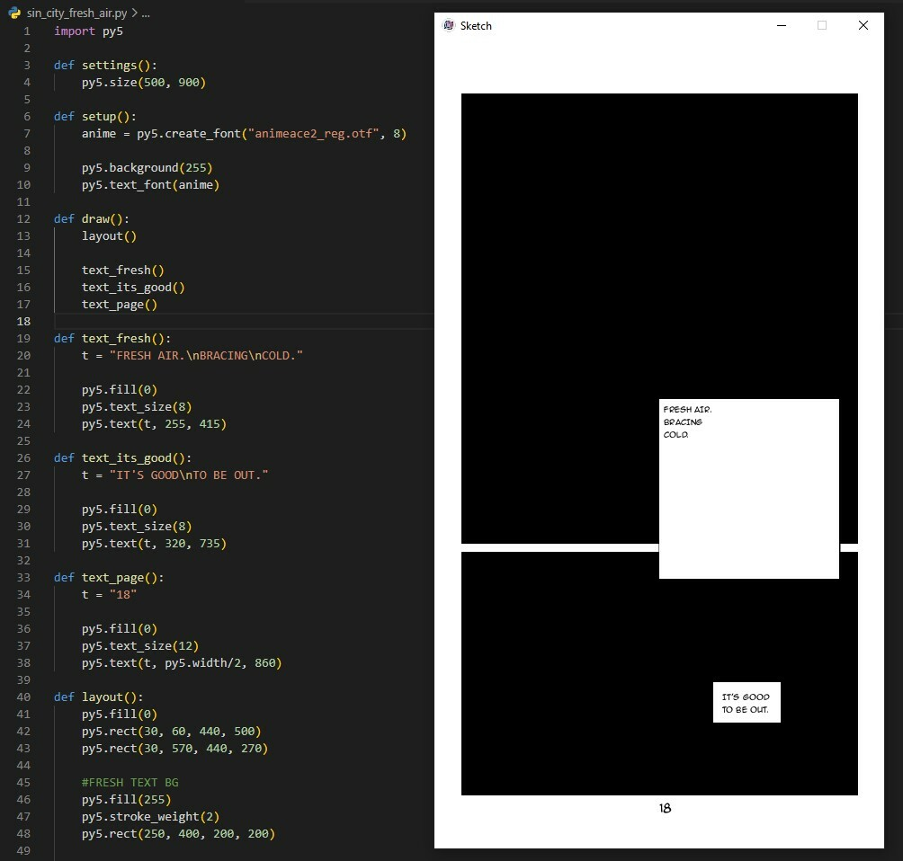
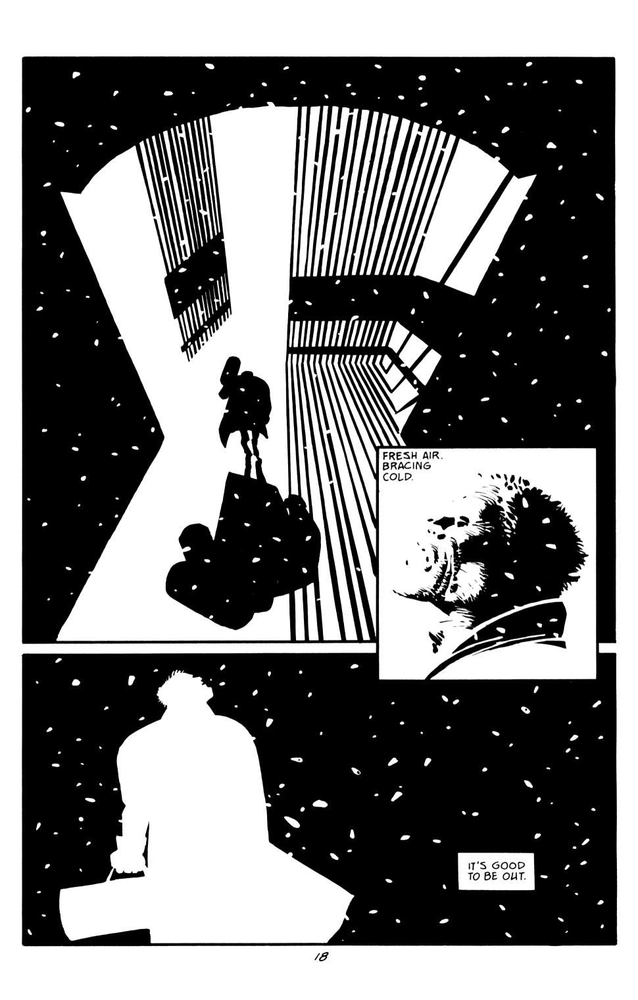
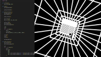
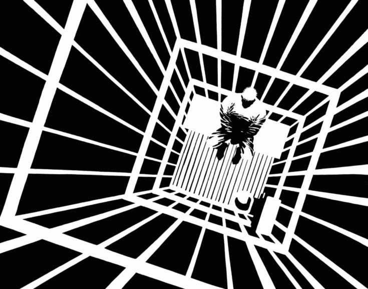

    
     
    

# Recoding Sin City

This project recoding two passages of Frank Miller's Sin City.

It's completely generated with Python using py5 framework.

## Official Selection

[Processing Community Day 2023 Porto](https://pcd.fba.up.pt/2023/exhibition/claromes.htm)

## Process

### Fresh Air scene
Paper:

Layout and text:

Reference:

### Jail Cell scene
Video:

Reference:

## Requirements

- [py5](https://py5.ixora.io/content/install.html)
- Python 3.8+
- Java 17

### Alternative setup

- [Thonny Python Editor](https://thonny.org/)
- Search and install py5 via "Manage packages"

**You don't need the thonny-py5mode plugin*

## Run skecthes

$ `python sin_city_fresh_air.py`

$ `python sin_city_jail_cell.py`

## Author

[Claromes](https://claromes.com)
